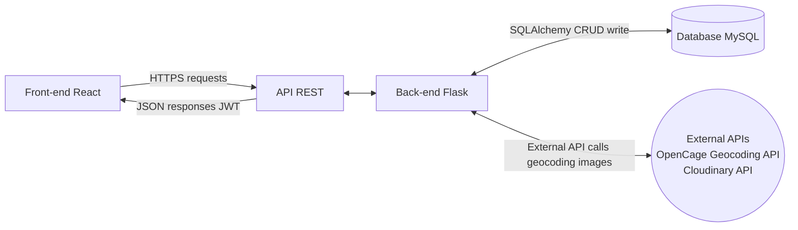
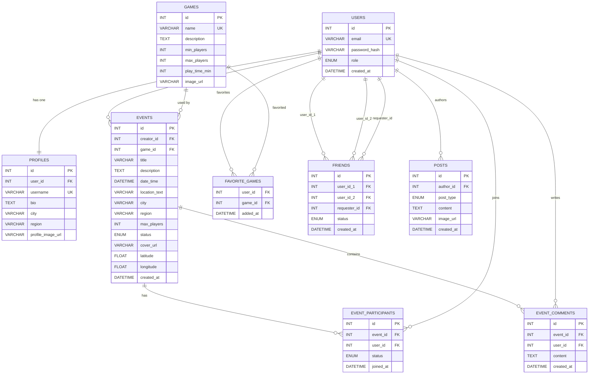

# BoardGame Hub 

Social platform for board game enthusiasts: create game nights, manage your friends, share your favorite games and chat with your community.

---

## Table of Contents

1. [Project Overview](#project-overview)
2. [Tech Stack](#tech-stack)
3. [Project Architecture](#project-architecture)
4. [Prerequisites](#prerequisites)
5. [Installation and Setup](#installation-and-setup)
6. [Running the Project](#running-the-project)
7. [Database](#database)
8. [REST API — Endpoints](#rest-api--endpoints)
9. [Environment Variables](#environment-variables)
10. [External Services](#external-services)
11. [Tests](#tests)
12. [File Structure](#file-structure)

---

## Project Overview

**BoardGame Hub** is a social network allowing people to:

- Register and manage their profile (profile picture, city, bio)
- Browse a board game catalog
- Create and join game nights
- Manage a friends list (request / accept / decline / remove)
- Publish posts on a news feed
- Search for users, games and events
- Mark games as favorites

---

## Tech Stack

### Backend

| Tool | Version | Role |
|---|---|---|
| Python | 3.10+ | Main language |
| Flask | 3.0.0 | Web framework |
| Flask-SQLAlchemy | 3.1.1 | ORM for MySQL |
| Flask-JWT-Extended | 4.6.0 | JWT authentication |
| Flask-CORS | 4.0.0 | CORS management |
| Flask-Limiter | 3.5.1 | Rate limiting |
| Flasgger | 0.9.7.1 | Swagger documentation |
| Cloudinary | 1.40.0 | Image storage |
| mysql-connector-python | 8.2.0 | MySQL driver |
| python-dotenv | 1.0.0 | .env variable loading |
| requests | 2.31.0 | HTTP calls (OpenCage) |

### Frontend

| Tool | Version | Role |
|---|---|---|
| React | 18+ | User interface |
| Vite | 7.x | Bundler and development server |
| React Router | 6+ | Client-side routing |
| react-icons | - | Icons |

### Database

- **MySQL** — Relational schema with 8 tables

### External Services

- **OpenCage Geocoding API** — Geocoding addresses when creating events
- **Cloudinary** — Image storage and CDN (profile pictures, event covers)

---

## Project Architecture

```
Portfolio-Project/
├── run.py                  # Flask entry point
├── config.py               # Centralized configuration (env vars)
├── requirements.txt        # Python dependencies
├── .env                    # Environment variables (not versioned)
├── app/
│   ├── __init__.py         # Flask factory
│   ├── api/
│   │   └── v1/
│   │       ├── __init__.py # Blueprint api_v1
│   │       ├── auth.py     # Register / Login
│   │       ├── events.py   # Game nights (CRUD + participation)
│   │       ├── friends.py  # Friends management
│   │       ├── games.py    # Game catalog
│   │       ├── posts.py    # News feed
│   │       ├── search.py   # Global search
│   │       └── users.py    # User profile, favorites
│   ├── models/
│   │   ├── user.py         # User model
│   │   ├── profile.py      # Profile model (1-to-1 with User)
│   │   ├── game.py         # Game model
│   │   ├── event.py        # Event model
│   │   ├── event_participant.py
│   │   ├── event_comment.py
│   │   ├── favorite_game.py
│   │   ├── friend.py       # Friend model (requests + links)
│   │   └── post.py         # Post model
│   ├── persistence/
│   │   └── repository.py   # Data access layer (Repository pattern)
│   └── services/
│       └── facade.py       # Business logic (Facade pattern)
├── database/
│   ├── schema.sql          # SQL script to create the DB
│   └── seed.py             # Initial data script (admins + games)
├── frontend/
│   ├── src/
│   │   ├── api/            # HTTP calls to the backend
│   │   ├── components/     # Reusable React components
│   │   ├── context/        # AuthContext (JWT token)
│   │   ├── pages/          # Main pages
│   │   ├── routes/         # ProtectedRoute
│   │   └── styles/         # CSS per page
│   └── public/
│       └── images/games/   # Board game images
└── tests/                  # Unit and integration tests (pytest)
```

### Vue d'ensemble des flux



### Patterns Used

- **Factory Pattern** : `create_app()` in `app/__init__.py`
- **Facade Pattern** : `app/services/facade.py` — single access layer for all business logic
- **Repository Pattern** : `app/persistence/repository.py` — abstraction over database access
- **Blueprint** : the API is organized as a Flask Blueprint (`api_v1`)

---

## Prerequisites

- Python 3.10+
- MySQL 8.0+
- A Cloudinary account
- An OpenCage Geocoding API key

---

## Installation and Setup

### 1. Clone the repo

```bash
git clone <https://github.com/WassefRPZ/Portfolio-Project.git>
cd Portfolio-Project
```

### 2. Backend — Virtual environment and dependencies

```bash
python3 -m venv .venv
source .venv/bin/activate
pip install -r requirements.txt
```

### 3. Create the `.env` file

At the root of the project, create a `.env` file:

```env
SECRET_KEY=a_very_long_secret_key
JWT_SECRET_KEY=another_jwt_secret_key

DB_HOST=127.0.0.1
DB_USER=root
DB_PASSWORD=your_mysql_password
DB_NAME=boardgame_hub

CORS_ORIGINS=http://localhost:5173

OPENCAGE_API_KEY=your_opencage_key
CLOUDINARY_CLOUD_NAME=your_cloud_name
CLOUDINARY_API_KEY=your_cloudinary_key
CLOUDINARY_API_SECRET=your_cloudinary_secret

SEED_ADMIN_PASSWORD=MotDePasse_Admin1!
FLASK_DEBUG=false
FLASK_PORT=5000
FLASK_HOST=127.0.0.1
```

### 4. Create the MySQL database

```bash
mysql -u root -p < database/schema.sql
```

### 5. Insert initial data

```bash
cd database
python3 seed.py
cd ..
```

### 6. Frontend — Dependencies

```bash
cd frontend
npm install
cd ..
```

---

## Running the Project

**Terminal 1 — Flask Backend:**

```bash
source .venv/bin/activate
python3 run.py
```

Backend available at: http://127.0.0.1:5000  
Swagger documentation: http://127.0.0.1:5000/apidocs/

**Terminal 2 — React Frontend:**

```bash
cd frontend
npm run dev
```

Frontend available at: http://localhost:5173

---

## Database

### Relational Schema

```
users (id, email, password_hash, role, created_at)
  │
  ├── profiles (id, user_id, username, bio, city, region, profile_image_url)
  │
  ├── events (id, creator_id, game_id, title, description, city, region,
  │           location_text, date_time, max_players, status, cover_url,
  │           latitude, longitude, created_at)
  │     ├── event_participants (id, event_id, user_id, status, joined_at)
  │     └── event_comments (id, event_id, user_id, content, created_at)
  │
  ├── favorite_games (user_id, game_id, added_at)
  │
  ├── friends (id, user_id_1, user_id_2, requester_id, status, created_at)
  │
  └── posts (id, author_id, post_type, content, image_url, created_at)

games (id, name, description, min_players, max_players, play_time_min, image_url)
```

### Diagramme



### Tables

| Table | Description |
|---|---|
| `users` | User accounts (email, hashed password, role) |
| `profiles` | Public profile (1-to-1 with users) |
| `games` | Board game catalog |
| `events` | Game nights created by users |
| `event_participants` | Event registrations (confirmed / pending) |
| `event_comments` | Comments on events |
| `favorite_games` | Favorite games per user |
| `friends` | Friend requests and friendships (pending / accepted) |
| `posts` | News feed posts (text / image / news) |

---

## REST API — Endpoints

**Base URL:** `http://127.0.0.1:5000/api/v1`  
**Authentication:** Bearer JWT Token in the `Authorization` header

### Auth

| Method | Route | Description | Auth |
|---|---|---|---|
| POST | `/auth/register` | Register | No |
| POST | `/auth/login` | Login | No |

### Users

| Method | Route | Description | Auth |
|---|---|---|---|
| GET | `/users/me` | My full profile | Yes |
| PUT | `/users/me` | Update my profile / photo | Yes |
| GET | `/users/<id>` | Public profile of a user | Yes |
| GET | `/users/search?q=&city=` | Search users | Yes |
| GET | `/users/me/favorite-games` | My favorite games | Yes |
| POST | `/users/me/favorite-games` | Add a favorite game | Yes |
| DELETE | `/users/me/favorite-games/<game_id>` | Remove a favorite game | Yes |

### Games

| Method | Route | Description | Auth |
|---|---|---|---|
| GET | `/games?limit=50&offset=0` | List all games | Yes |
| GET | `/games/search?q=` | Search a game by name | Yes |

### Events

| Method | Route | Description | Auth |
|---|---|---|---|
| GET | `/events` | List open events | Yes |
| POST | `/events` | Create an event | Yes |
| GET | `/events/<id>` | Event details | Yes |
| PUT | `/events/<id>` | Update an event (creator) | Yes |
| DELETE | `/events/<id>` | Cancel an event (creator) | Yes |
| POST | `/events/<id>/join` | Join an event | Yes |
| POST | `/events/<id>/leave` | Leave an event | Yes |
| GET | `/events/<id>/comments` | Event comments | Yes |
| POST | `/events/<id>/comments` | Post a comment | Yes |

**Available filters for GET /events:**
- `city` — filter by city
- `date` — filter by date (ISO 8601 format: `2024-12-25`)
- `lat`, `lng`, `radius` — filter by geolocation (radius in km, max 200)
- `limit`, `offset` — pagination

### Friends

| Method | Route | Description | Auth |
|---|---|---|---|
| GET | `/friends` | My friends list | Yes |
| GET | `/friends/pending` | Pending received requests | Yes |
| GET | `/friends/sent` | Sent requests | Yes |
| POST | `/friends/request/<receiver_id>` | Send a friend request | Yes |
| POST | `/friends/accept/<requester_id>` | Accept a request | Yes |
| POST | `/friends/reject/<requester_id>` | Decline a request | Yes |
| DELETE | `/friends/<user_id>` | Remove a friend | Yes |

### Posts

| Method | Route | Description | Auth |
|---|---|---|---|
| GET | `/posts` | News feed | Yes |
| POST | `/posts` | Create a post | Yes |
| GET | `/posts/<id>` | Post details | Yes |
| PUT | `/posts/<id>` | Update your post | Yes |
| DELETE | `/posts/<id>` | Delete your post | Yes |
| GET | `/posts/user/<user_id>` | Posts by a user | Yes |

### Search

| Method | Route | Description | Auth |
|---|---|---|---|
| GET | `/search?q=` | Global search (users + events + games) | Yes |

---

## Environment Variables

| Variable | Required | Description |
|---|---|---|
| `SECRET_KEY` | Yes | Flask secret key |
| `JWT_SECRET_KEY` | Yes | JWT key |
| `DB_HOST` | No (127.0.0.1) | MySQL host |
| `DB_USER` | Yes | MySQL user |
| `DB_PASSWORD` | No | MySQL password |
| `DB_NAME` | Yes | Database name |
| `CORS_ORIGINS` | No (*) | Allowed CORS origins |
| `OPENCAGE_API_KEY` | Yes* | OpenCage API key |
| `CLOUDINARY_CLOUD_NAME` | No | Cloudinary cloud name |
| `CLOUDINARY_API_KEY` | No | Cloudinary key |
| `CLOUDINARY_API_SECRET` | No | Cloudinary secret |
| `SEED_ADMIN_PASSWORD` | Yes (seed) | Admin password for the seed script |
| `FLASK_DEBUG` | No (false) | Flask debug mode |
| `FLASK_PORT` | No (5000) | Flask port |
| `FLASK_HOST` | No (127.0.0.1) | Flask host |

---

## External Services

### OpenCage Geocoding API

Used when **creating an event** to convert a text address (`location_text`) into GPS coordinates (`latitude`, `longitude`) and extract the city (`city`) and region (`region`).

- **Endpoint:** `https://api.opencagedata.com/geocode/v1/json`
- **Documentation:** https://opencagedata.com/api

### Cloudinary

Used for **storing images** uploaded by users.

The returned URLs are stored in the database (`profile_image_url`, `cover_url`).

- **Documentation:** https://cloudinary.com/documentation

---

## Tests

```bash
source .venv/bin/activate
pytest tests/ -v
```

Tests run against a dedicated isolated database (`boardgame_hub_test`) and mock all external services (OpenCage, Cloudinary) — no real HTTP calls are made.

### Test Files

| File | Tests | Coverage |
|---|---|---|
| `conftest.py` | — | Shared fixtures, helpers, test DB setup, external service mocks |
| `test_auth.py` | 15 | Register, login, input validation, duplicate detection |
| `test_events.py` | 18 | CRUD events, join/leave, comments, permission checks |
| `test_friends.py` | 22 | Send/accept/reject/remove requests, list friends, pending/sent |
| `test_games.py` | 3 | Game listing, search by name |
| `test_posts.py` | 13 | CRUD posts, feed listing, pagination, ownership checks |
| `test_search.py` | 6 | Global search (users + events + games), no data leaks |
| `test_users.py` | 9 | Profile get/update, user search, favorite games |

**Total: 98 tests — 0 failures**

> **Note:** The test database `boardgame_hub_test` must be accessible with the credentials defined in `.env`. It is created automatically on first run.

## Features

- **Authentication**: Register, Login (JWT).
- **Events**: Create, search (by city/date), join, cancel.
- **Users**: Profiles, friends management, favorite games.
- **Games**: Game catalog, search.
- **Social**: Comments on events.

## Tech Stack

- **Language**: Python 3.x
- **Framework**: Flask
- **Database**: MySQL
- **ORM**: SQLAlchemy
- **API Documentation**: Flasgger (Swagger UI)

## Installation

### 1. Prerequisites
- Python 3.8 or higher
- MySQL Server installed and running

### 2. Clone the project
```bash
git clone [https://github.com/WassefRPZ/Portfolio-Project.git]
cd portfolio-project

Install dependencies
Bash
pip install -r Portfolio-Project-app/requirements.txt

# .env
FLASK_APP=run.py
FLASK_ENV=development

# Database
DB_HOST=127.0.0.1
DB_USER=root
DB_PASSWORD=""
DB_NAME=boardgame_meetup

# Security
SECRET_KEY=a_very_secret_and_random_key
JWT_SECRET_KEY=another_secret_jwt_key

 Starting the app
The launch script automatically initializes the tables and injects test data (Admin, Games) if they don't already exist.

Bash
cd Portfolio-Project-app
python3 run.py
The API will be available at: http://127.0.0.1:5000/api/v1/

Swagger documentation is available at: http://127.0.0.1:5000/apidocs/

 Tests and Documentation
Endpoints are documented via Swagger. Once the server is running, visit /apidocs to test routes directly from the browser.
 
Authors
Portfolio Project - Wassef / Warren